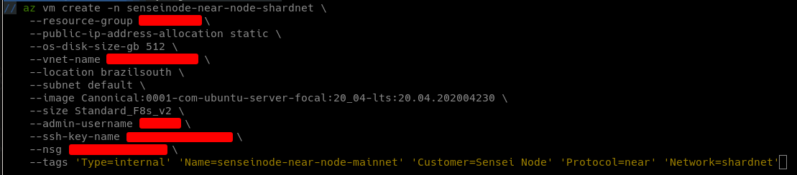

# Introduction

- Install `Near Core` and `Near-CLI`
- Before completing this guide, your `MUST` first create a Wallet:

- Shardnet: [wallet.shardnet.near.org](https://wallet.shardnet.near.org)
- Mainnet: [wallet.near.org](https://wallet.near.org)

# Deploy Server

- For this guide we have used an `Azure VM` to install the `Near node`, we have used their CLI but it could also be deployed trough their website.



- The important thing is that the machine meets the minimum requirements for `Near` to run and sufficient disk to store the blockchain. For shardnet chunk producers, the required hardware is as following:

| Hardware       | Chunk-Only Producer  Specifications                                   |
| -------------- | ---------------------------------------------------------------       |
| CPU            | 4-Core CPU with AVX support                                           |
| RAM            | 8GB DDR4                                                              |
| Storage        | 500GB SSD                                                             |

# Installation

- First we will upgrade the OS and dependencies

```shell
sudo apt update && sudo apt upgrade -y
```

- Install developer tools, `Node.js` and `npm`:

```shell
curl -sL https://deb.nodesource.com/setup_18.x | sudo -E bash -
```

```shell
sudo apt install build-essential nodejs
```

```shell
PATH="$PATH"
```

## Install Near CLI

```shell
sudo npm install -g near-cli
```

- Set the environment for your Near-CLI (shardnet or mainnet)

```shell
export NEAR_ENV=shardnet
```

- You can make the env  persistent adding it to `~/.profile` or `~/.bashrc` `(depending on the OS)`. 

## Installing the Node

- Install Developers tools:

```shell
sudo apt install -y git binutils-dev libcurl4-openssl-dev zlib1g-dev libdw-dev libiberty-dev cmake gcc g++ python protobuf-compiler libssl-dev pkg-config clang llvm cargo
```

- Make sure `python3 pip` is install, if not proceed to install it:

```shell
sudo apt install python3-pip
```

- Install Rust and Cargo:

```shell
curl --proto '=https' --tlsv1.2 -sSf [https://sh.rustup.rs](https://sh.rustup.rs/) | sh
```

```shell
source $HOME/.cargo/env
```

- Clone the Near Core repository:

```shell
git clone https://github.com/near/nearcore
```

- Navigate to `nearcore` folder:

```shell
cd nearcore
```

- Run the following command:

```shell
git fetch
```

- For Stake Wars you would need to check out a certain commit: [https://github.com/near/stakewars-iii/blob/main/commit.md](https://github.com/near/stakewars-iii/blob/main/commit.md) (ignore when in mainnet)

```shell
git checkout <commit>
```

- Build binaries (ignore shardnet flag for mainnet):

```shell
cargo build -p neard --release --features shardnet
```

- Create working directory

```shell
./target/release/neard --home ~/.near init --chain-id shardnet --download-genesis
```

- Go to `~/.near` directory and change config.json - for shardnet you can copy the config.json found here [https://s3-us-west-1.amazonaws.com/build.nearprotocol.com/nearcore-deploy/shardnet/config.json](https://s3-us-west-1.amazonaws.com/build.nearprotocol.com/nearcore-deploy/shardnet/config.json) 

- These are the parameters you usually have to modify:

```shell
"tracked_shards": [0]
```

```shell
"archive": false
```

```shell
"boot_nodes": "<INSERT BOOTNODES>"
```

- Start the node

```shell
./target/release/neard --home ~/.near run
```


## Create Validator

- Link your wallet to your created account:

```shell
near login
```


- You must then go to the link provided in your console and grant access to your account.


- After that, you will need to create the validator key.

```shell
near generate-key <pool_id>
```

```shell
<pool_id> == xx.factory.shardnet.near WHERE xx is you pool name, for example senseinode.factory.sharednet.near
```

- Move the newly created file to your `~/.near` directory:

```shell
`cp ~/.near-credentials/shardnet/YOUR_WALLET.json ~/.near/validator_key.json`
```

- File must follow this pattern, make sure to change `private_key` for `secret_key` if necessary:

```json
{
"account_id": "xx.factory.shardnet.near",
"public_key": "ed25519:HeaBJ3xLgvZacQWmEctTeUqyfSU4SDEnEwckWxd92W2G",
"secret_key": "ed25519:****"
}
```

- Stop and start your Validator Node again, you should see the `validator` flag in the logs:


# Register Staking Pool

- The following commands will use senseinode.shardnet.near account and senseinode.factory.shardnet.near as the staking pool, you must modify these parameters and the public keys to create your own staking pools. 

### Create Staking Pool

```jsx
near call factory.shardnet.near create_staking_pool '{"staking_pool_id": "senseinode", "owner_id": "senseinode.shardnet.near", "stake_public_key": "ed25519:EfTpUmWR369JqZVf7UnrFsyQVXQ3fhFvNqbhMiDZEGU2", "reward_fee_fraction": {"numerator": 5, "denominator": 100}, "code_hash":"DD428g9eqLL8fWUxv8QSpVFzyHi1Qd16P8ephYCTmMSZ"}' --accountId="senseinode.shardnet.near" --amount=30 --gas=300000000000000
```

### Stake

```jsx
near call senseinode.factory.shardnet.near deposit_and_stake --amount 200 --accountId senseinode.shardnet.near --gas=300000000000000
```

### Ping

```jsx
near call senseinode.factory.shardnet.near ping '{}' --accountId senseinode.shardnet.near --gas=300000000000000
```

### Balances

```jsx
near view senseinode.factory.shardnet.near get_account_total_balance '{"account_id": "senseinode.shardnet.near"}'
```

### View Staked Balances

```jsx
near view senseinode.factory.shardnet.near get_account_staked_balance '{"account_id": "senseinode.shardnet.near"}'
```

### Pause

```jsx
near call senseinode.factory.shardnet.near pause_staking '{}' --accountId senseinode.shardnet.near
```

### Resume

```jsx
near call senseinode.factory.shardnet.near resume_staking '{}' --accountId senseinode.shardnet.near
```

### Check Validator Info

```jsx
curl -s -d '{"jsonrpc": "2.0", "method": "validators", "id": "dontcare", "params": [null]}' -H 'Content-Type: application/json' [http://localhost:3030/](http://localhost:3030/)
```

### Monitor Your Validator

- The following script is the base for a monitor tool that checks your validator status. Make sure to change the staking_pool variable to your own pool name.

```python
import requests as r
import json

url = 'http://localhost:3030'

data = json.dumps({"jsonrpc": "2.0", "method": "validators", "id": "dontcare", "params": "latest"})

headers = {'content-type': 'application/json'}

res = r.post(url, headers = headers, data = data).json()

#input your staking pool
staking_pool = 'senseinode.factory.shardnet.near'

# check current validators
for i in res['result']['current_validators']:
    if i['account_id'] == staking_pool:
        print(i)
    else:
        continue

# check reason for kickout
for i in res['result']['prev_epoch_kickout']:
    if i['account_id'] == staking_pool:
        print(i)
    else:
        continue
```

- Result example:

`{'account_id': 'senseinode.factory.shardnet.near', 'is_slashed': False, 'num_expected_blocks': 15, 'num_expected_chunks': 37, 'num_produced_blocks': 14, 'num_produced_chunks': 34, 'public_key': 'ed25519:EfTpUmWR369JqZVf7UnrFsyQVXQ3fhFvNqbhMiDZEGU2', 'shards': [0], 'stake': '2309034326111880772000000000'}`

- For a staking pool in the current validator set you must make sure that `num_expected_blocks` and `num_expected_chunks` match the `num_produced_blocks` ad `num_produced_chunks`

# Other Tools

- Ping script that needs to be run every epoch to update delegartors balance: [https://gist.github.com/PixelNoob/d9ad19ffb22d246e25955c1ac3065076](https://gist.github.com/PixelNoob/d9ad19ffb22d246e25955c1ac3065076)
